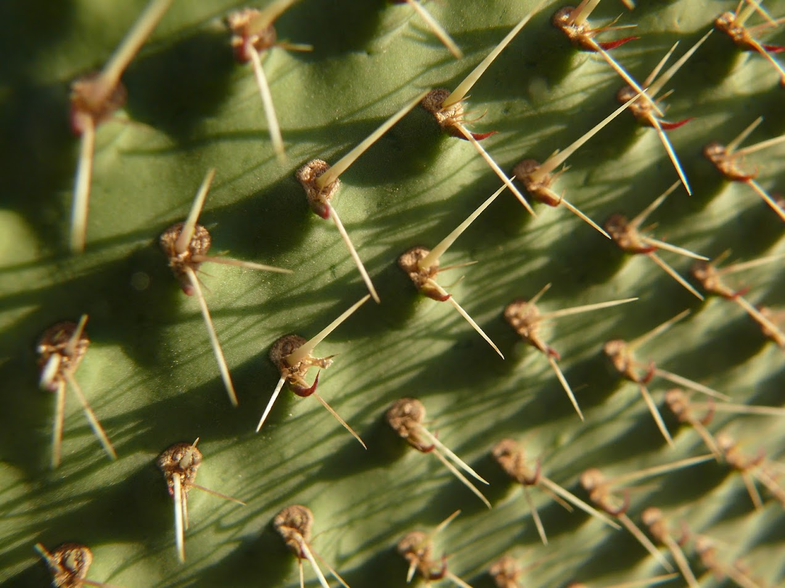

```{r setup, include=FALSE}
knitr::opts_chunk$set(echo = FALSE)
```
Cuando se tira esta carta, se canta algo así como: "Al nopal lo van a ver nomás cuando tiene tunas", o, "El auxilio de San Luis que le llaman el nopal" No tengo idea de que signifique este último, ni de a quién se le ocurrieron estas cosas pero si se el porqué yo elegí a El Nopal como el primer amigurumi para comenzar esta aventura. Son muchas razones pero la principal: ¡Me encanta comer nopalitos! De hecho, mi comida favorita en el mundo mundial lleva nopales: "La carne de puerco con nopalitos de mi mamacita".
Así es, como alimento, el nopal es muy parte de la gastronomía mexicana, desde la penca y por supuesto, ¡las tunas!. Cuando le pregunto a mis sobrin@s ¿cuál es su fruta favorita? , uno inmediatamente dice: ¡tunas!...otra dice que los tejocotes , pero esa es otra historia.
Entonces, quería hacer algo muy mexicano y por eso también comienzo con el nopal, que hasta en nuestra bandera esta y es simbolo nacional y toda la cosa, pero porque además viste a tantos hermosos paisajes en todo el país, incluyendo al pedacito de tierra que me vió nacer.También simpre escojo una carta que tenga el nopal cuando juego a la loteria así que si es un favorito. Por esto y mas, es mi carta No.1 de esta aventura.
Hablando de tejido y amigurumis, la verdad hay cientos, miles de patrones (instrucciones) para hacer amigurumis de cactus allá afuera, pero nopales, lo que se dice nopales (pues no les dicen nopales xq casi todo mundo solo les dice cactus así en general, pero no entremos en más detalles)...casi no hay.
Así que espero que disfruten tejiendo este nopal y se sumen a esta aventura de tejer los 54 personajes, que probablemente tomará un tiempo, pero, como un majestuoso nopal que pacientemente acumula el agua en sus carnosas pencas para poder crecer bracito a bracito cubriendose de espinas protectoras para poder llegar a ese momento en que por fin podrá dar todas esas hermosas flores que darán origen a la deliciosura de frutos que son las tunas y así poder esparcir las semillas (o alguno que otro bracito) y poder cobijar algún otro pedazo de tierra...¡así ustedes! Tomen mucha agua y tenganme paciencia (solo esta parte era para la analogía, no se cubran de espinas, ni suelten los bracitos ni nada de lo demás).
Y si ya leyeron hasta acá y quisieran seguir viendo un poco de lo especial es el nopal, les dejo algunas fotitos e historias, incluyendo la deliciosa receta de carne con nopalitos de mi mamá x si a alguien se le antojó.


